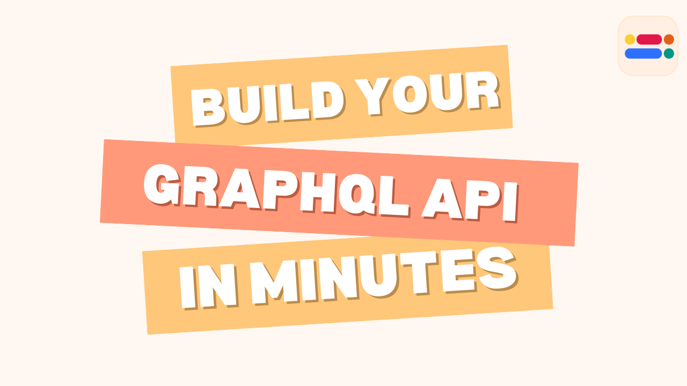
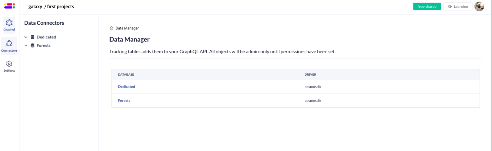

GraphQL has taken the API world by storm, offering a powerful and flexible way to query and manipulate data. It allows you to request exactly the data your application needs, leading to cleaner code and faster development.

In this blog post, we'll dive into how you can leverage the Zeromagic Platform to create your very first GraphQL API. We'll explore the platform's features and guide you through the setup process, making it easy to get started with GraphQL and unlock its benefits for your projects.
<!-- truncate -->

### Step 1: Login to Project Console
Login to [Zeromagic Platform](https://github.com/) and go to you `Project Console`. Now navigate to `GraphQL` in the sidebar of the console.
 


### Step 2: Create a GraphQL Endpoint

Navigate to `Create GraphQL` button and this will open a form to create a GraphQL endpoint.
- Name : Name of the Graph API
- API Path: Define the base URL path that will be used to access the API endpoints. 

:::info Important

`graphql/` will be appened to the base URL path. You can not pass anyother parameters such as query parameters, etc in the API Path field.

:::

```jsx title="Example"
API Path: orders/
Final GraphQL Endpoint: orders/graphql/
``` 


Once created, click on the `GraphiQL` button, this will take you to the GraphQL console.

### Step 3: Create a Database
Create a database (BYOD or on-premises ) named `Forests` in your Database section in the project console.

:::tip Reference
Refer here to know how to [Connect Databases to Zeromagic](/datasources/quickstart/)
:::

The created database will be listed in the `Connectors` section in the `GraphQL Console`


 
### Step 4: Create a logical model

Within each data source, you will see a list of tables displayed in an `not listed` tab initially. 


To **list** a table, simply click on it and select the `list` option which will open the model editor. 

> A logical model is a representation of your data structure that will be used in your GraphQL schema. 

Here, you can define model fields and relationships, tailoring the model to fit your specific needs. After defining the model click on `Create Logical Model` button to create your logical model.


<!-- Establish connections to your underlying data sources. These could be databases, APIs, or other services that hold the actual data your GraphQL endpoint will serve. 

Select the database you want to connect
Create the appropriate logical model for the tables in data source. Configure these connectors to allow your GraphQL schema to interact with the data effectively. -->


:::tip Reference
- [Learn about Data connectors](/graphql/dataconnectors/)
- [Connect Databases to Zeromagic](/datasources/quickstart/)
:::

Once your logical model is defined, the Zeromagic platform will **automatically** generate the necessary schema for both mutations and queries. This ensures that your data is accurately represented and easily accessible through your GraphQL endpoint.

The `Listed` tab shows all the tables you've chosen to list. Click on a specific table to view detailed information about the `logical model`. On this page, you can edit model fields and relationships, making adjustments as needed to reflect changes in your data structure or requirements.


 
### Step 5: Graphql Schema Registry

You can view the `schema` by nagivating to the `GraphQL` page.


:::info Note
The schema is automatically generated based on model fields and cannot be edited.
:::


### Step 5: Test in GraphiQL

Click on the `GraphQL` option in the sidebar to open the GraphiQL playground. This interface allows you to test your queries and mutations in real-time, ensuring everything works as expected.

The GraphiQL interface includes three useful menus on the right sidebar:

- **Show Documentation Explorer:** Access a detailed, interactive representation of your GraphQL schema. This helps you understand the available data types, fields, and relationships within your data.
- **Show History:** Review your previously executed queries for quick reference.
- **Show Data Explorer:** Visually navigate your data structures and explore them without writing complex queries.


By following these steps, you will be able to connect your data sources, list tables, and create logical models on the Zeromagic platform. This process streamlines the creation of your GraphQL API, allowing you to focus on building robust and efficient applications. Get started today and experience the power of Zeromagic for yourself!

