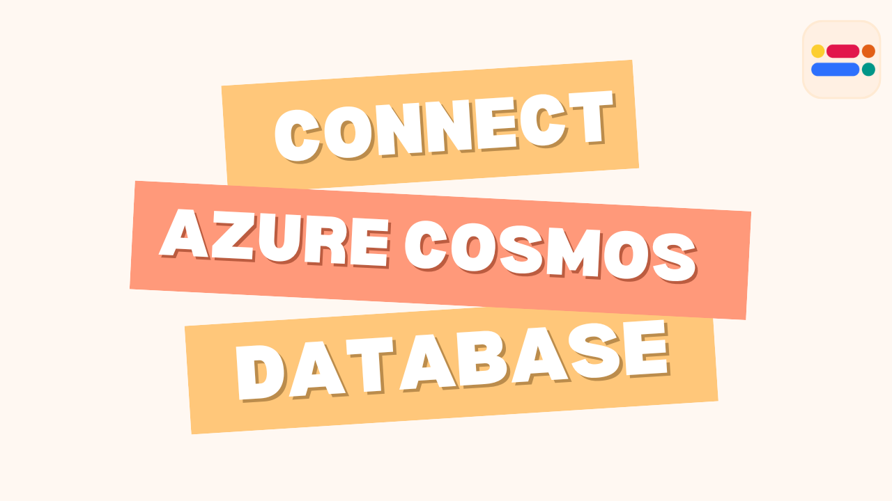
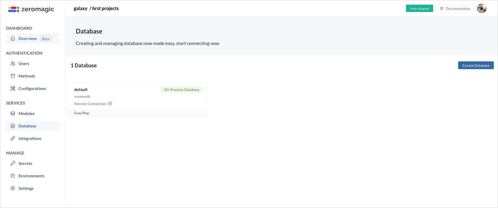
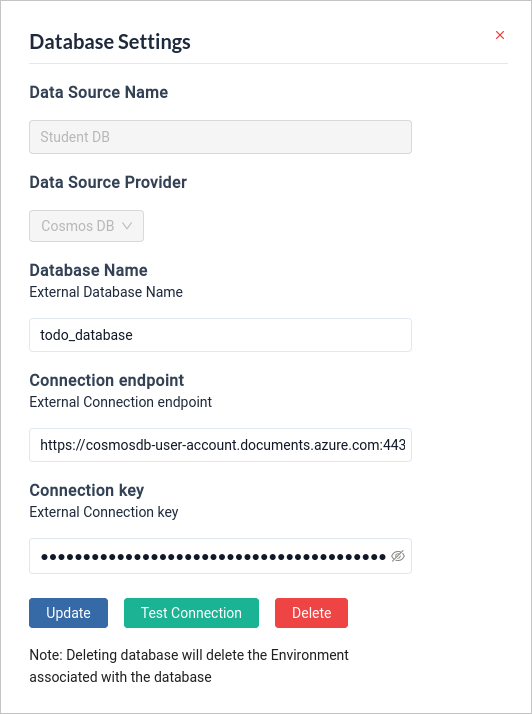

In this blog post, we'll guide you through connecting your external database, specifically Azure Cosmos DB, to the Zeromagic Platform in a matter of minutes. This seamless integration unlocks the power of Zeromagic's functionalities for your Cosmos DB data, allowing for efficient data management and automation.

<!-- truncate -->

## Steps to Connect Your Cosmos DB to Zeromagic

### 1. Log In and Navigate to Database
- Log in to the [Zeromagic Platform](https://github.com/).
- Go to your `Project Console`.
- Navigate to the `Database` section in the sidebar of the console.
- Click on `Create Database` to start the process of creating a new database.

### 2. Enter Database Source Information

- Provide a `Database Source Name` to help identify your database source on the platform.
- Select the appropriate `Database Provider` to connect to your database.

### 3. Toggle External Connection
- Enable the `External Connection` option to use an external connection for database integration.

### 4. Configure Database Connection

- **Cosmos Database Name:** Enter the exact name you assigned to your Cosmos DB database in Azure.

- **Connection URI:** Locate and provide the unique connection URI for your Cosmos DB account. You can find this string within the Azure portal for your specific Cosmos DB instance. This URI acts as a secure access key.

- **Connection Key:** Select either the `PRIMARY KEY` or `SECONDARY KEY` as your connection method to access your Cosmos DB. It's recommended to use the secondary key for everyday operations and keep the primary key as a backup for critical situations.

### 5. Connect Database

Click on the `Connect Database` button to establish the connection between your external Cosmos DB and your Zeromagic project.

### 6. Test Database Connection

Once you have established the connection, you can **test** the connection by clicking on `Test Connection`. 

:::info Note

**Connection Limitations:** This connection method is currently only compatible with Azure Cosmos DB for NoSQL databases.

**Creating a Cosmos DB:** If you don't have an existing Cosmos DB account, you can follow the official Microsoft tutorial to set one up: https://learn.microsoft.com/en-us/azure/cosmos-db/try-free
:::

### References

[Try Azure Cosmos DB free](https://learn.microsoft.com/en-us/azure/cosmos-db/try-free)