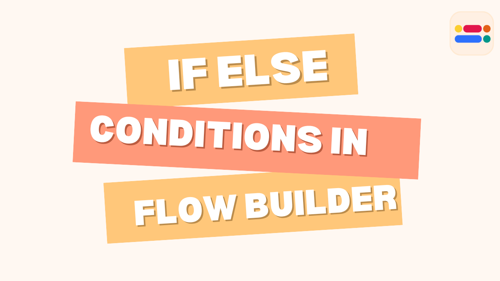
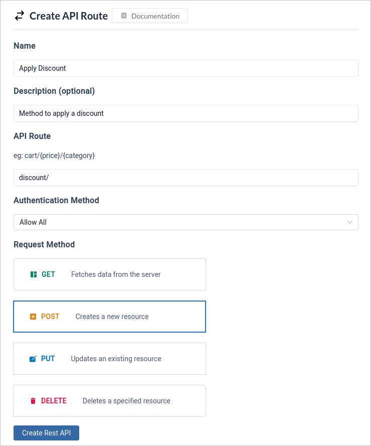
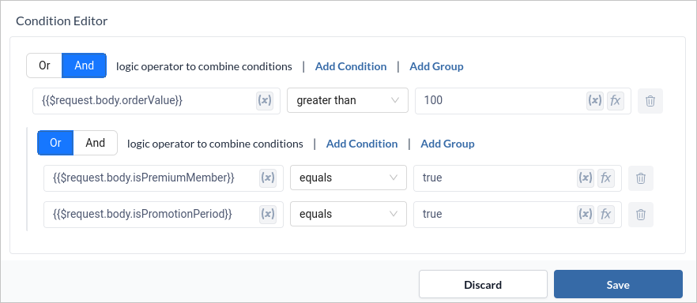
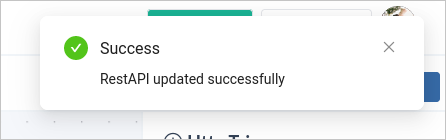

This blog post will guide you through the world of if-else conditions in workflows, making your processes smarter and more efficient. 

The if-else condition is a basic programming construct used to execute different actions based on whether a condition is true or false.If-else conditions work similarly in workflow automation.If-else conditions can be used to direct the flow of tasks, handle exceptions, and ensure that the workflow adapts to varying inputs and scenarios.



## How IfElse Works:

1. **Set a Condition:** Define a condition that needs to be met, like `Order amount is greater than $100` or `Customer location is in Europe`.

2. **Evaluate the Condition:** The workflow checks if the condition is true or false.

3. **Branch Out:** Based on the outcome, the workflow follows a predetermined path:
 - _If True:_ Execute the actions associated with the `true` branch.
 - _Else:_ Execute the actions associated with the `else` branch.

<!-- truncate -->

## Example Scenario : Check if Order has Discount 

Let's consider an e-commerce workflow where we need to check if an order qualifies for a discount. The criteria could be:
- The total order value exceeds $100.
- The customer is a premium member.
- The order is placed during a special promotion period.

```jsx title="Example"
If (orderValue > 100 && (isPremiumMember || isPromotionPeriod) ) {
    // Logic to apply discount
    return {"response" : "Discount Applied"}
} else { 
    // Regular order processing
    return {"response" : "Discount Not Applied"}
}
```

### Setting up workflow
1. Create a `Post` method which will take body data as `orderValue`, `isPremiumMember`, and `isPromotionPeriod`.



2. Using an if-else, evaluate the combined condition to check if the combined criteria are met.



3. Add a JSON block with Action name as `true_json` in True branch with `key=response` and `value=Discount Applied`. Update the Response Block output to `{{$true_json.val}}` and status code to `200`.

```json title="Sample True Response" 
{
    "response": "Discount Applied"
}
```

4. Add a JSON block with Action name as `false_json` in False branch with `key=response` and `value=Discount Not Applied`. Update the Response Block output to `{{$false_json.val}}`and status code to `200`.

```json title="Sample False Response" 
{
    "response": "Discount Not Applied"
}
```


5. Click `Deploy` to update the flow and to utilise your API.



### Testing the Discount API using Postman
