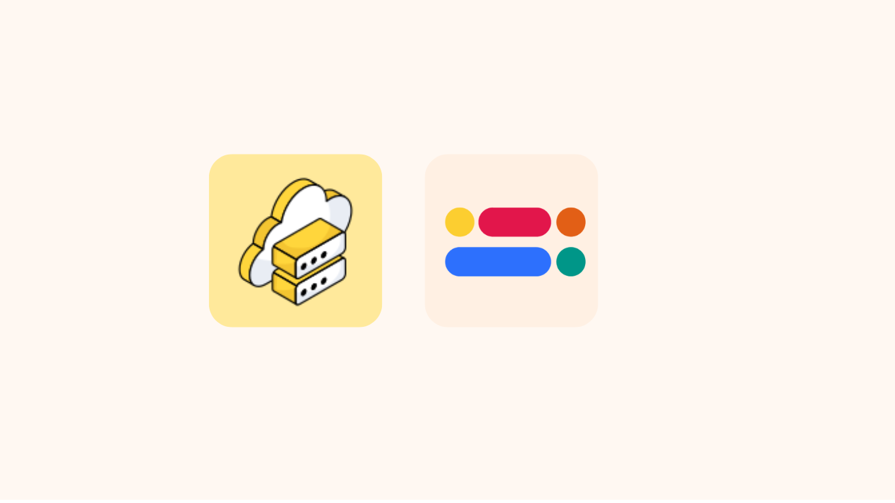

  


import Tabs from '@theme/Tabs';
import TabItem from '@theme/TabItem';

In this blog post, we will explore how to leverage multiple environments on our platform to efficiently manage and fetch REST APIs. Our platform allows you to define different environments, each with its own base URL, making it easier to handle development, testing, and production stages of your applications.
 

### What is an Environment?

An environment is a distinct configuration setting that defines the base URL and other specific parameters for your REST APIs. This setup allows you to switch between different stages of your application, such as development, testing, and production, without changing the core code.

### Why Use Multiple Environments?

Using multiple environments helps you:

- Isolate Development Stages: Keep development, testing, and production settings separate.
- Avoid Configuration Errors: Minimize the risk of using incorrect URLs or settings.
- Facilitate Testing: Test APIs in different scenarios without affecting production data.
- Flexibility: Easily switch between environments based on your needs.

<!-- truncate -->

## Setting Up Multiple Environments

Start by defining the different environments you need in the `Environments` section of the `Project Console`. Common examples include Development, Testing, and Production. Each environment will have its own base URL.


In your application, you can switch between environments based on your current stage. This can be done by setting the environment configuration at runtime.

:::info Information

Reference: [Learn to Create Environment](/basics/environment/)
 
::: 


## Fetching REST APIs with Environments


Let’s say you have an API endpoint to fetch user data. The endpoint remains the same across environments, but the base URL changes.

Your platform has two environments: development (dev) and production (prod).

- Development Environment: Base URL: `https://dev.your-api.com/api/v1`
- Production Environment: Base URL: `https://prod.your-api.com/api/v1`


### Step 1: Create a Function to Fetch Data
Create a function to fetch user data that dynamically uses the base URL based on the current environment.


<Tabs groupId="operating-systems">
  <TabItem value="javascript" label="Javascript">

  ```js

  const APP_KEY = "your_app_key"

  async function fetchUserData(environment, userId) {
  const baseUrl = environment.baseUrl;
  const appKey = environment.appKey;
  const endpoint = `/users/${userId}`;
  const url = `${baseUrl}${endpoint}`;

  const headers = {
    'APP_KEY': `${APP_KEY}`
  };

  try {
    const response = await fetch(url, {
      method: 'GET',
      headers: headers
    });

    if (!response.ok) {
      throw new Error(`Error fetching user data: ${response.statusText}`);
    }

    const data = await response.json();
    console.log('User Data:', data);
    return data;
  } catch (error) {
    console.error(error);
    return null;
  }
}

  ```
  </TabItem>
  <TabItem value="python" label="Python">

  ```py
  import requests

APP_KEY = "your_app_key"

def fetch_user_data(environment, user_id):
    base_url = environment["base_url"]
    endpoint = f"/users/{user_id}"
    url = f"{base_url}{endpoint}"

    headers = {
        "APP_KEY": f"{APP_KEY}"
    }

    try:
        response = requests.get(url, headers=headers)
        response.raise_for_status()  # Raise an error for bad status codes
        data = response.json()
        print('User Data:', data)
        return data
    except requests.exceptions.RequestException as e:
        print(f"Error fetching user data: {e}")
        return None

  ```  
  </TabItem>
</Tabs>


:::info Information
Ensure your APP_KEY is securely managed using secrets in the production environment. 
::: 

### Step 2: Set the Current Environment

A dictionary `environments` holds the configuration for different environments created in the Zeromagic platform. 

<Tabs groupId="operating-systems">
  <TabItem value="javascript" label="Javascript">
  
  ```js
  const environments = {
    development: {
        name: "Development",
        baseUrl: "https://dev.api.yourplatform.com"
    },
    production: {
        name: "Production",
        baseUrl: "https://api.yourplatform.com"
    }
};

// Set the current environment
const currentEnvironment = environments.development;
```
  
  </TabItem>
  <TabItem value="python" label="Python">
  
  ```py
  environments = {
    "development": {
        "name": "Development",
        "base_url": "https://dev.api.yourplatform.com"
    }, 
    "production": {
        "name": "Production",
        "base_url": "https://api.yourplatform.com"
    }
}

# Set the current environment
current_environment = environments["development"]
  ```
  </TabItem>
</Tabs>

### Step 3: Fetch Data Using the Current Environment

The function fetch_user_data is called with the current environment and a user ID to fetch the user data.

<Tabs groupId="operating-systems">
  <TabItem value="javascript" label="Javascript">
  
  ```js
fetchUserData(currentEnvironment, 12345);
```
  
  </TabItem>
  <TabItem value="python" label="Python">
  
  ```py 
user_data = fetch_user_data(current_environment, 12345)
  ```
  </TabItem>
</Tabs>


This approach allows you to dynamically switch between different environments by simply changing the value of current environment, making your API management more flexible and robust.

Using multiple environments to fetch REST APIs is a powerful strategy to manage different stages of your application lifecycle. By defining distinct configurations for development, testing, and production, you can isolate and control your API interactions effectively. This not only enhances your development workflow but also ensures that your application remains robust and error-free across various environments.