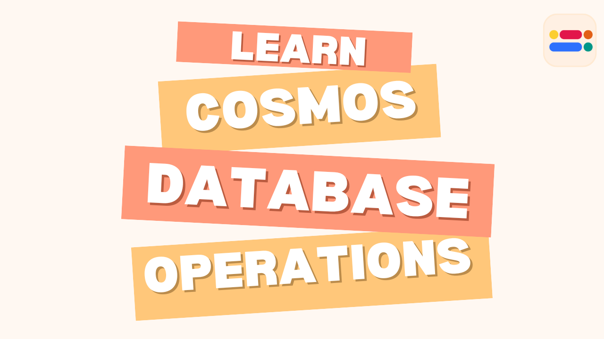
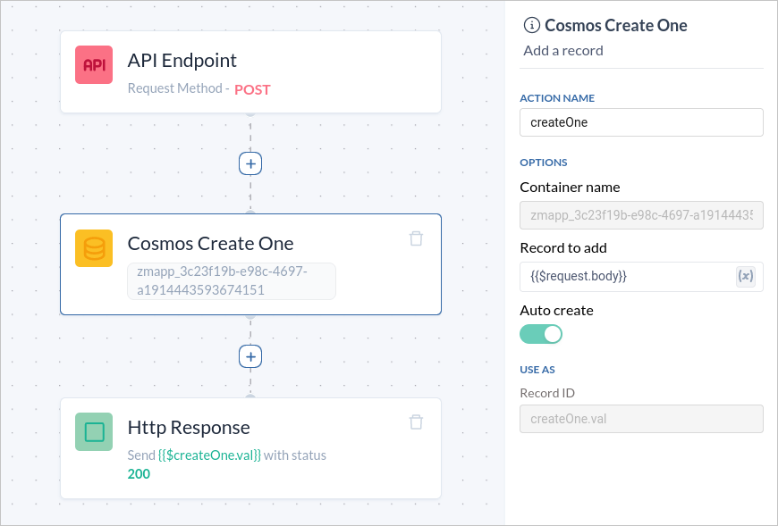
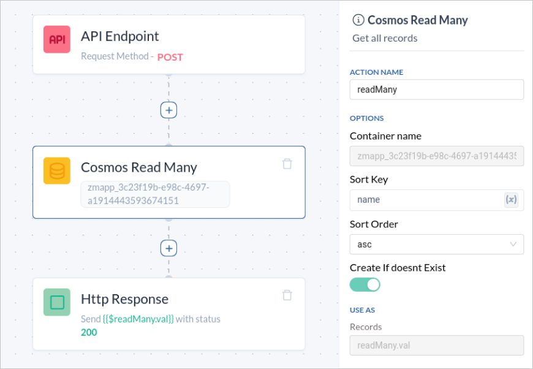
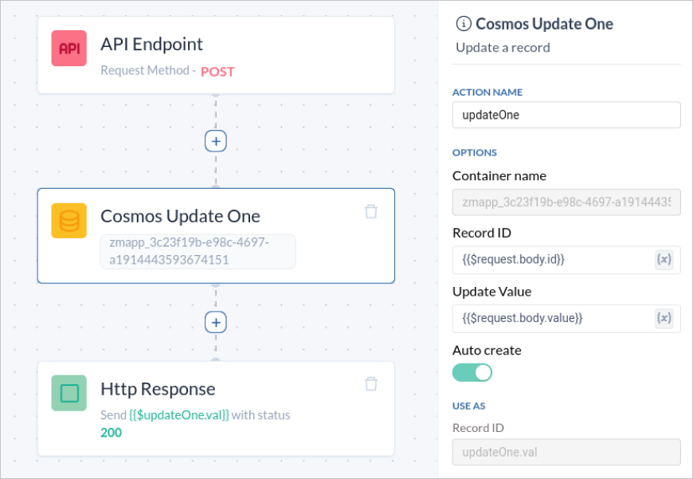
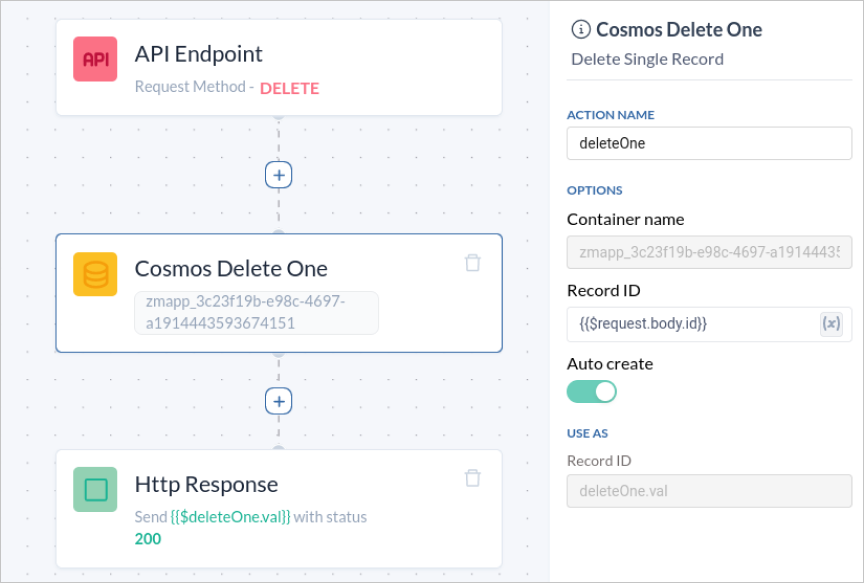

Do you need a highly scalable and globally distributed NoSQL database for your modern application? Look no further than Azure Cosmos DB!

In this blog post, we will dive into the various operations you can perform on Azure Cosmos DB using the Zeromagic platform. Whether you need to create, read, update, or delete data, Zeromagic provides a set of predefined actions to help you manage your database efficiently. These operations include CreateOne, CreateMany, ReadOne, ReadMany, DeleteOne, DeleteMany, UpdateOne, UpdateMany, and Custom Filter queries. Let's explore each operation in detail to understand how you can use them to manage your Cosmos DB effectively.

<!-- truncate -->

:::info Reference 

Check [here](/datasources/zeromagic-query-language/overview/) to learn more about Zeromagic Query Language
 
:::

Login to [Zeromagic Platform](https://github.com/) and go to you `Project Console`. Now navigate to `Modules` in the sidebar of the console. Click on the necessary Module and navigate to the Flow Builder Page.

## CreateOne

The `CreateOne` operation allows you to insert a single document into your Cosmos DB container. This is useful when you need to add individual records to your database.

1. Add a CreateOne block to your workflow. Set the `record to add` field to `{{$request.body}}` so as to specify the data that will be used to create the new record.
2. In the `Http Response` block , set the `Response Variable` field to expression as `{{$block-name.val}}`.
 


### Sample Test Data

```jsx title="Request Body Data"
{
    "id": "1",
    "name": "John Doe",
    "email": "john.doe@example.com",
    "courses" : ["maths", "science", "english"],
    "dept" : "CSE"
}
```

```jsx title="Response Data"
{
  "data-result": {
    "data": [
      {
        "_attachments": "attachments/",
        "_module": "rest",
        "_rid": "AZYTAK-jPQYFAAAAAAAAAA==",
        "_self": "dbs/AZYTAA==/colls/AZYTAK-jPQY=/docs/AZYTAK-jPQYFAAAAAAAAAA==/",
        "_ts": 1717046615,
        "courses": "[maths, science, english]",
        "dept": "CSE",
        "id": "1",
        "name": "John Doe"
        "email": "john.doe@example.com"
      }
    ]
  },
  "status": 200
}
```

## CreateMany

The `CreateMany` operation enables you to insert multiple documents at once. This is ideal for batch operations where you need to add several records simultaneously.

1. Add a CreateMany block to your workflow. Set the `Create Value` field to `{{$request.body}}` so as to specify the data that will be used to create the new record.
2. In the `Http Response` block , set the `Response Variable` field to expression as `{{$block-name.val}}`.
 


### Sample Test Data

```jsx title="Request Body Data"
 [
  {
    "id": "2",
    "name": "Jim Beam",
    "email": "jim.beam@example.com",
    "courses" : ["physics", "english"],
    "dept" : "ECE"
},
{
    "id": "3",
    "name": "Jane Doe",
    "email": "jane.doe@example.com",
    "courses" : ["maths", "science"],
    "dept" : "CSE"
} 
]
```

```jsx title="Response Data"
{
  "data-result": {
    "data": [
      { 
        "courses": "[maths, science, english]",
        "dept": "CSE",
        "id": "1",
        "name": "John Doe"
        "email": "john.doe@example.com"
      },
      { 
        "courses": "physics, english]",
        "dept": "ECE",
        "id": "2",
        "name": "Jim Beam"
        "email": "jim.beam@example.com"
      },
      { 
        "courses": "[maths, science]",
        "dept": "CSE",
        "id": "3",
        "name": "Jane Doe"
        "email": "jane.doe@example.com"
      }
    ]
  },
  "status": 200
}
```
 

## ReadOne

The `ReadOne` operation allows you to retrieve a single document based on its unique identifier. This is useful when you need to fetch specific records.

1. Add a ReadOne block to your workflow. Set the `Record Id` field to `{{$request.body.id}}` so as to specify the data that will be used to create the new record.
2. In the `Http Response` block , set the `Response Variable` field to expression as `{{$block-name.val}}`.


### Sample Test Data

```jsx title="Request Body Data"
{
    "id": "1"
}
```

```jsx title="Response Data"
{
  "data-result": {
    "data": [
      { 
        "courses": "[maths, science, english]",
        "dept": "CSE",
        "id": "1",
        "name": "John Doe"
        "email": "john.doe@example.com"
      } 
    ]
  },
  "status": 200
}
```
 
## ReadMany

The `ReadMany` operation lets you fetch multiple documents that match a given criteria. This is beneficial for retrieving a set of records based on certain conditions.


1. Add a ReadMany block to your workflow.  Set the `Sort Key` field to **name**, which corresponds to the data key in the schema, and choose either `asc` or `desc` for the `Sort Order`, depending on how you want the data to be sorted.

2. In the `Http Response` block , set the `Response Variable` field to expression as `{{$block-name.val}}`.


### Sample Test Data

```jsx title="Response Data"
{
  "data-result": {
    "data": [
      { 
        "courses": "[maths, science]",
        "dept": "CSE",
        "id": "3",
        "name": "Jane Doe"
        "email": "jane.doe@example.com"
      },
      { 
        "courses": "physics, english]",
        "dept": "ECE",
        "id": "2",
        "name": "Jim Beam"
        "email": "jim.beam@example.com"
      },
      { 
        "courses": "[maths, science, english]",
        "dept": "CSE",
        "id": "1",
        "name": "John Doe"
        "email": "john.doe@example.com"
      } 
    ]
  },
  "status": 200
}
```
## UpdateOne
The `UpdateOne` operation allows you to modify a single document. This is helpful when you need to update specific fields of a record.

1. Add a UpdateOne block to your workflow. Set the `Record Id` field to `{{$request.body.id}}` and `Update Value` to `{{$request.body.value}}` to specify the data that will be used to update the existing record.
2. In the `Http Response` block , set the `Response Variable` field to expression as `{{$block-name.val}}`.


### Sample Test Data

```jsx title="Request Body Data"
{
    "id": "1",
    "value":  {
      "name": "Maxwell",
      "email": "maxwell@example.com",
    }
}
```

```jsx title="Response Data"
{
  "data-result": {
    "data": [
      { 
        "courses": "[maths, science, english]",
        "dept": "CSE",
        "id": "1",
        "name": "Maxwell"
        "email": "maxwell@example.com"
      } 
    ]
  },
  "status": 200
}
```

## UpdateMany

The `UpdateMany` operation allows you to modify multiple documents. This is helpful when you need to update specific batch of records.

1. Add a UpdateMany block to your workflow. Set the `Filter Query` field to your desired query according to your data retrieval and `Update Value` to `{{$request.body}}` to specify the data that will be used to update the existing record.
2. In the `Http Response` block , set the `Response Variable` field to expression as `{{$block-name.val}}`.

 
### Sample Test Data

```jsx title="Response Data"
{
  "data-result": {
    "data": [
      
    ]
  },
  "status": 200
}
```


## DeleteOne

The `DeleteOne` operation deletes a single document based on its unique identifier. This is useful for removing individual records such as deleting a user account.

1. Add a DeleteOne block to your workflow. Set the `Record Id` field to `{{$request.body.id}}` so as to specify the data that will be used to create the new record.
2. In the `Http Response` block , set the `Response Variable` field to expression as `{{$block-name.val}}`.



### Sample Test Data

```jsx title="Request Body Data"
{
    "id": "1" 
}
```

```jsx title="Response Data"
{
  "data-result": {
    "data": [
      
    ]
  },
  "status": 200
}
```

## DeleteMany

The `DeleteMany` operation deletes multiple documents based on a query. This is ideal for bulk deletions such as removing all inactive accounts.

1. Add a DeleteMany block to your workflow. Set the `Delete Query` field to your desired query according to the data that will be used to delete the existing record.
2. In the `Http Response` block , set the `Response Variable` field to expression as `{{$block-name.val}}`.


### Sample Test Data

```jsx title="Response Data"
{
  "data-result": {
    "data": [
      
    ]
  },
  "status": 200
}
```

## CustomQuery

The `CustomQuery` operation allows for complex querying with custom filters. This is ideal for advanced data retrieval scenarios like filtering users by multiple criteria.

:::info Reference 

Check [here](/datasources/zeromagic-query-language/operators-property/) to learn more about Zeromagic Query Operators and Property.
 
:::

1. Add a CustomQuery block to your workflow. Set the `Custom Aggregate Query` field to your desired query according to the data that will be used to manipulate the existing record.
2. In the `Http Response` block , set the `Response Variable` field to expression as `{{$block-name.val}}`.


### Sample Test Data

```jsx title="Response Data"
{
  "data-result": {
    "data": [
      
    ]
  },
  "status": 200
}
```

Understanding and utilizing these operations will empower you to manage your Cosmos Database effectively, whether you need to create, read, update, or delete data. Our platform simplifies these tasks, enabling you to focus on building robust applications with ease.

Explore the power of Cosmos Database operations on our platform and elevate your data management capabilities today!