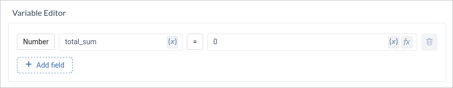
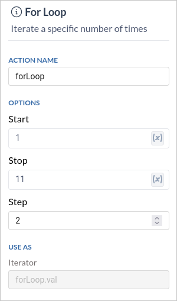
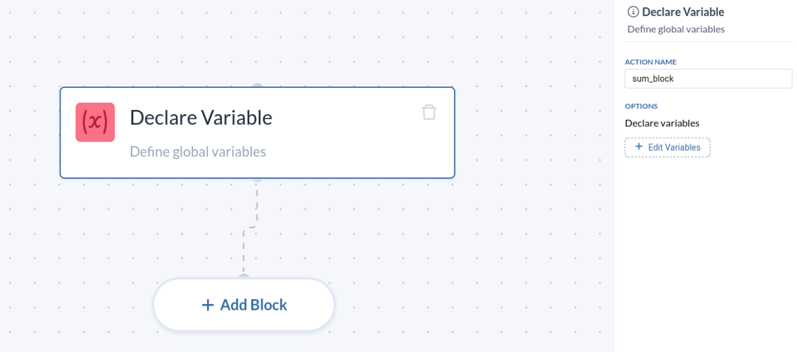
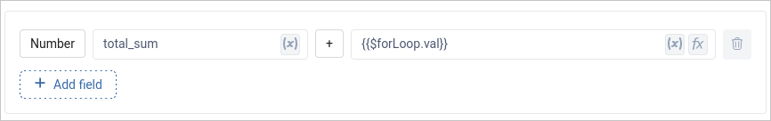
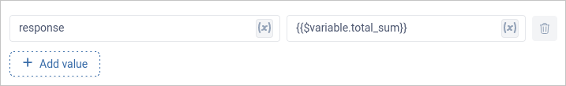

 


For loops are a fundamental programming construct that enables you to repeat a set of actions a specified number of times. When integrated into workflows, for loops can significantly enhance your processes by automating repetitive tasks. This blog post will guide you through using for loop conditions in workflows, focusing on start, stop, and step values to create more efficient and smart processes.

A for loop is a control flow statement that executes a block of code a certain number of times. In workflows, for loops are used to iterate over a range of values, performing specific actions at each iteration. The three main components of a for loop are:

1. **Start:** The initial value of the loop variable.
2. **Stop:** The value at which the loop terminates.
3. **Step:** The increment (or decrement) by which the loop counter is updated after each iteration.

These components allow you to define the exact range and increments for your loop, providing precise control over the number of iterations.

<!-- truncate -->

## Example: Using For Loops in a Workflow

Let's consider a simple example to illustrate how to use for loops with start, stop, and step values in a workflow. Suppose we want to create a workflow that sums a sequence of even numbers from 1 to 11, incrementing by 2 each time.

Here’s how you can set it up:

- Start Value: 1
- Stop Value: 11
- Step Value: 2

The workflow will execute the loop, starting from 1, and incrementing by 2 each time, until it reaches or exceeds 11.

```py title="Sample Pseudo Code" 
total_sum = 0

for even_number in range(start_value, stop_value, step_value):
    # Perform your action here
    total_sum += even_number

print total_sum
```
### Step 1: Declare variables

Add a `Variable Block` to the workflow and create a new variable `total_sum` of type `Number` with initial value `0`.



### Step 2: For Loop Block

Add a `For Loop Block` to the workflow and declare start, stop and step value.


### Step 3: Sum values inside Loop Block
Click on the `expand` icon on the For Loop Block and this prompts to flow builder page where you can build you logic. Add a `Variable` block to sum the values. 



To access the current index of the use the following syntax

```jsx
{{$forloop-name.val}} 
```



### Step 4: Build JSON Object

Add a new block called `Build JSON` and name it **json**. This block will be responsible for creating the final output of your workflow, which is in JSON format. In this case, we want to include the calculated `total_sum`.



### Step 5: Return Success Response
 
Add a final block called `HTTP Response`. This block will send the response back to the system that triggered the workflow.Inside the "HTTP Response" block, configure it to return the **JSON object** you created in the previous step.


:::info Info 
Documentation of For Loop can be found [here](/restapi/flow-builder/blocks/flow-control/for-loop/)
:::


By understanding and utilizing the start, stop, and step values, you can create highly efficient and precise loops to handle a variety of tasks. Whether you're generating sequences, processing data, or automating repetitive actions, for loops can make your workflows smarter and more effective. Try incorporating for loops into your workflows today and experience the benefits of automation and efficiency.